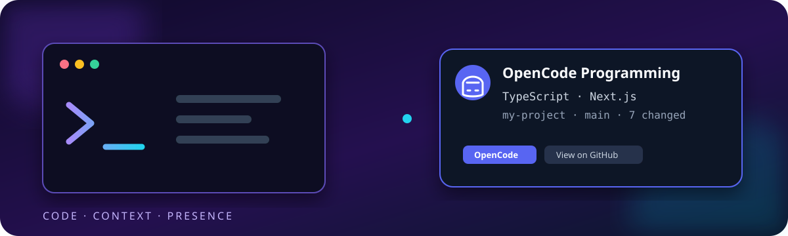
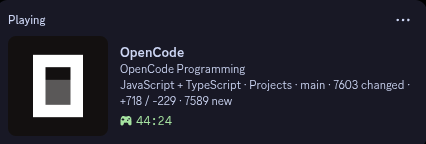

<div align="center">



# OpenCode Discord Rich Presence

### Show what you are coding in Discord, automatically.

[](https://github.com/mistercyb3r/opencode-discord-rpc)
[](https://nodejs.org/)
[](LICENSE)
[](https://github.com/mistercyb3r/opencode-discord-rpc/releases)

**OpenCode Discord Rich Presence** watches your active OpenCode sessions and creates a useful Discord status. It can show your project, programming language, framework, Git branch, changed files, build commands, idle state, and even the game you are playing.

</div>

### Real-world example

This is what the presence looks like in Discord while OpenCode is active:

<p align="center">
  
</p>

The status updates automatically as your project, language, Git branch, activity, or game changes.

## What Does It Do?

Instead of a vague status such as **AI coding session**, your friends can see something useful:

```text
OpenCode Programming
TypeScript + SQL · Next.js · my-project · main · 7 changed
```

When you start a game, it can switch automatically:

```text
Gaming
No Man's Sky
```

When Discord or the RPC bridge restarts, the service reconnects by itself.

## Before You Start

This project is for Linux users running OpenCode.

You need:

- OpenCode
- Discord Desktop, or a compatible Discord IPC bridge such as [arRPC](https://github.com/ampen-labs/arrpc)
- Node.js 18 or newer
- `sqlite3`
- A Linux desktop using systemd user services

The installer does not install Discord, OpenCode, or arRPC for you.

## Quick Install

### 1. Create a Discord application

Open the [Discord Developer Portal](https://discord.com/developers/applications):

1. Click **New Application**.
2. Give it a name, for example `OpenCode Presence`.
3. Open **General Information**.
4. Copy the **Application ID**.

You do not need a bot or a Discord token.

### 2. Install the presence service

Open a terminal and paste:

```bash
git clone https://github.com/mistercyb3r/opencode-discord-rpc.git
cd opencode-discord-rpc
./install.sh
```

The installer checks your Node.js and SQLite setup, offers to ask for your Discord Application ID, installs the service, and starts it when the ID is provided.

### 3. Add your Application ID

Open the generated config file:

```bash
nano ~/.config/opencode-rpc/config.json
```

Replace:

```json
"clientId": "YOUR_DISCORD_APPLICATION_ID"
```

with your real Application ID, save the file, then restart:

```bash
systemctl --user restart opencode-rpc.service
```

Open Discord, start OpenCode inside a project, and your presence should appear within about 15 seconds.

## Supported Linux systems

The project is designed for systemd-based Linux desktops and has been tested on Arch-family systems such as CachyOS. The same setup should work on Fedora, Ubuntu, and Debian when Node.js 18+, `sqlite3`, systemd user services, and Discord/arRPC are installed.

Install prerequisites with your distribution:

```bash
# Arch / CachyOS
sudo pacman -S nodejs npm sqlite

# Fedora
sudo dnf install nodejs npm sqlite

# Ubuntu / Debian
sudo apt install nodejs npm sqlite3
```

## arRPC

On Linux, Discord IPC may require [arRPC](https://github.com/ampen-labs/arrpc). If you already have an `arrpc.service`, this project starts after it automatically.

If Discord presence does not appear, check that the bridge is running:

```bash
systemctl --user status arrpc.service
```

## What It Detects

- Active OpenCode project and session
- Project name without exposing the full path
- Git branch
- Changed file count and line statistics
- Up to two programming languages
- Frameworks and tools such as Next.js, React, Tauri, Rust, Python, Go, Astro, Angular, Electron, Vite, Docker, CMake, Make, and more
- Build and test commands such as `cargo test`, `pytest`, `pnpm build`, and `docker compose`
- Idle coding sessions
- Selected Steam games
- Discord/arRPC disconnects and reconnects

## Privacy

The presence shows project and branch names only. It does **not** send:

- Absolute file paths
- File contents
- Commit messages
- Source code
- Discord credentials or tokens

You can hide project and Git information in `~/.config/opencode-rpc/config.json`:

```json
{
  "clientId": "YOUR_DISCORD_APPLICATION_ID",
  "showProject": false,
  "showBranch": false,
  "showGitStats": false
}
```

## Configuration

```json
{
  "clientId": "YOUR_DISCORD_APPLICATION_ID",
  "updateIntervalSeconds": 15,
  "idleAfterMinutes": 20,
  "showProject": true,
  "showBranch": true,
  "showGitStats": true,
  "detectGames": true
}
```

| Setting | What it changes |
| --- | --- |
| `clientId` | Your Discord Application ID |
| `updateIntervalSeconds` | How often Discord is refreshed |
| `idleAfterMinutes` | When the status becomes idle |
| `showProject` | Shows the project folder name |
| `showBranch` | Shows the current Git branch |
| `showGitStats` | Shows changed files and line counts |
| `detectGames` | Switches the status while a supported game runs |

## Troubleshooting

Check the service:

```bash
systemctl --user status opencode-rpc.service
```

Watch live logs:

```bash
journalctl --user -u opencode-rpc.service -f
```

Restart after changing configuration:

```bash
systemctl --user restart opencode-rpc.service
```

If the status is missing, check these three things:

1. Discord Desktop is open.
2. arRPC or another Discord IPC bridge is running.
3. Your Application ID is correct in `~/.config/opencode-rpc/config.json`.

## License

MIT. See [LICENSE](LICENSE).
